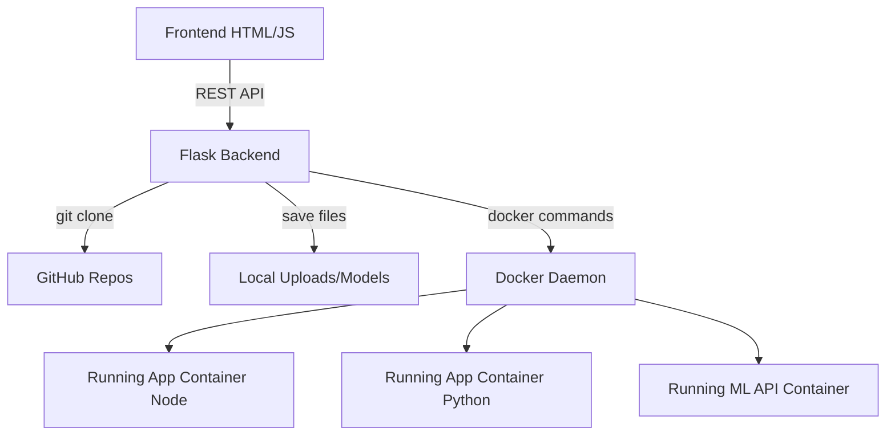
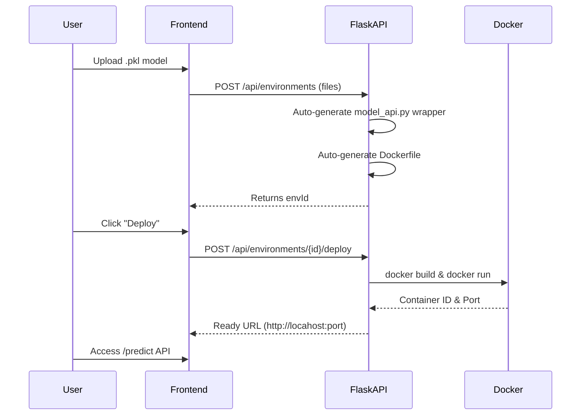
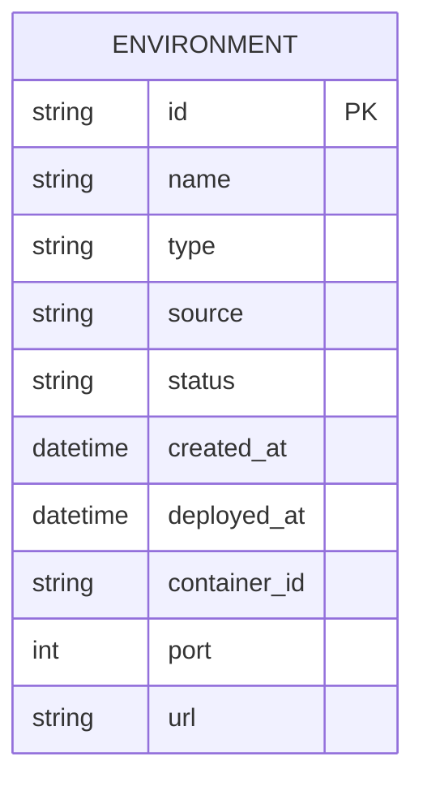

# System Architecture & Academic Documentation

## Overview

This document outlines the architecture for the **Automated DevOps-Based Deployment Dashboard with AI/ML Model Support**. Designed as a robust Final Year Academic Project, it bridges the gap between raw code development and seamless cloud/containerized deployment.

## Architecture Guidelines

### High-Level Components
1. **Frontend**: A vanilla HTML/CSS/JS dashboard responsible for user interactions, file capturing, and log visualizations.
2. **Flask Backend API**: The REST gateway and orchestrator. Handles file uploads via `werkzeug`, synchronizes with `sqlite`, and delegates Docker actions.
3. **Docker Engine**: The underlying execution host that processes dynamic `Dockerfile` setups and runs images.

## Diagrams (Mermaid)

### 1. High-Level Architecture Diagram

### 2. Sequence Diagram (ML Deployment Flow)

### 3. Entity-Relationship (ER) Diagram

## System Limitations & Future Enhancements
- **Limitations**:
  - The dynamic generation of Dockerfiles assumes standard root locations (e.g. `app.py` or `package.json`). Deeply nested apps may fail without a custom Dockerfile.
  - Port assignments are dynamically chosen from available localhost ports but rely on the environment being internally exposed perfectly.
- **Future Enhancements**:
  - **AWS EC2 / Kubernetes Support**: Abstract the Docker SDK calls into cloud-native API deploy procedures (e.g., EKS/ECS deployment).
  - **Redis Task Queues**: Move `docker build` (which is synchronous and can block server threads for large images) to async Celery/Redis workers.
  - **Authentication / JWT**: Tie environments to specific logged-in users.

## SDG Alignment
**SDG 9: Industry, Innovation, and Infrastructure**
By abstracting complicated cloud concepts (networking, dockerizing, and ML wrapping), this dashboard provides resilient infrastructure knowledge to novice engineers autonomously, heavily promoting rapid, inclusive technological innovation.
